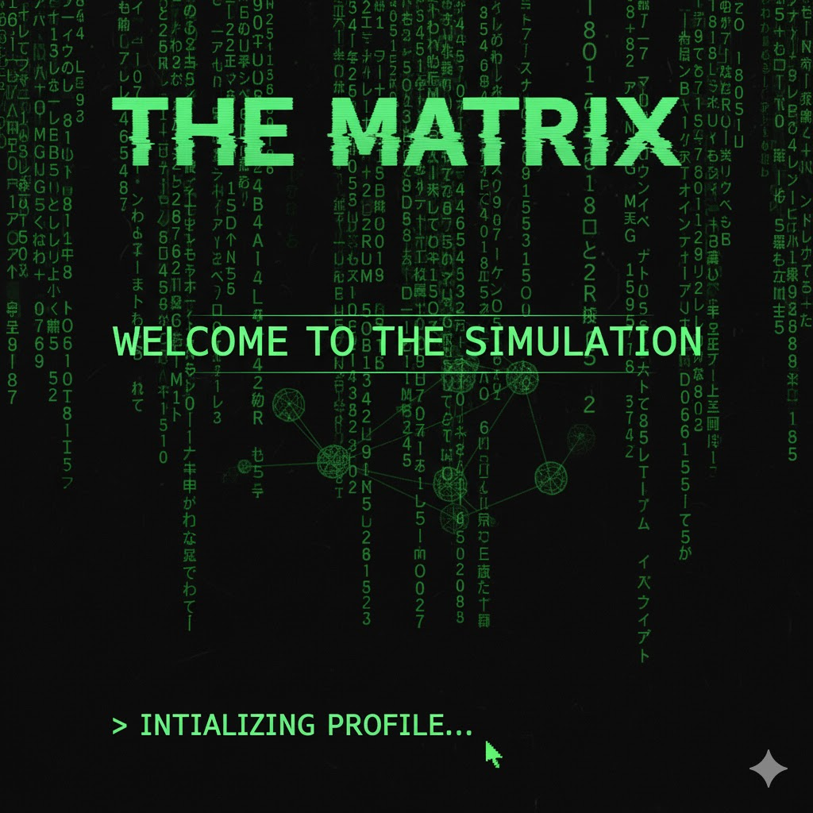

  
  

#  Olá, Mundo Digital! Sou Robson Dias!

  "Bem-vindo(a) à simulação. Escolha a pílula certa para explorar meu universo de código."

---

### 💻 Sobre Mim (Decifrando o Código)

Estou no início da minha jornada como desenvolvedor, com uma paixão por criar soluções e resolver problemas. Meu foco atual é construir uma base sólida em Front-End, mas meu objetivo final é me tornar um desenvolvedor Full-Stack completo.

🌱 Atualmente estou focado em dominar as tecnologias essenciais do **Front-End: HTML, CSS e JavaScript**.

🚀 Meu próximo passo é mergulhar em frameworks modernos (como **React ou Vue**) para construir interfaces ricas e dinâmicas.

🧠 Meu grande objetivo é evoluir para **Full-Stack**, expandindo meus conhecimentos para o **Back-End** (**Node.js**, por exemplo) e Bancos de Dados.

💡 **Estou sempre aberto a aprender, colaborar e aplicar meus conhecimentos em projetos práticos.**

---

### 💻 Minha Caixa de Ferramentas (Em Construção!)
Aqui estão as tecnologias que estou explorando e dominando:

**Atualmente Aprendendo (Front-End):**

**Próximos Passos (O Caminho do Full-Stack):**

**Ferramentas Essenciais:**

---

### 📈 Estatísticas do GitHub (Seus Dados na Matriz)

  
  

---

### 🤝 Conecte-se (Encontre-me na Realidade Virtual)

  
  
  

---

  "A matriz está em todo lugar. Ela está à nossa volta. Mesmo agora, nesta sala." - Morpheus

